# Google Solution Challenge 2021 - XI Patronum

### Dated: 31st March 2021
## Contributors
---
* <a href="https://github.com/Zulfa210">Zulfa Attar</a>
* <a href="https://github.com/priyagopal12">Priyadarshini Gopal</a>
* <a href="https://github.com/gautamik2030">Gautami Kumbhar</a>
* <a href="https://github.com/rane-shubham">Shubham Rane</a>

## Description
---
### UN Goals achieved in our project
* Goal 1 - No poverty
* Goal 2 - Zero hunger
* Goal 3 - Good health and well being
* Goal 4 - Quality education
* Goal 5 - Gender equality and women empowerment
* Goal 6 - Clean water and sanitation
* Goal 10 - Reduced inequalities
* Goal 12 - Responsible consumption and production
* Goal 13 - Climate action
* Goal 14 - Life below water
* Goal 15 - Life on land
 

### Challenge we are solving:
Today, there are a lot of people willing to donate their time and resources to charity. Their major problem is where and how do they start. We provide our users a platform where they can find and connect with a number of charitable organizations at the same time. This simplifies the process by providing the user all the resources in one place. The user can contact various organizations via our platform and give to different charities without the hussle of keeping track of them on different platforms. Our aim is to simplify the process while encourage more people to donate to charity.  

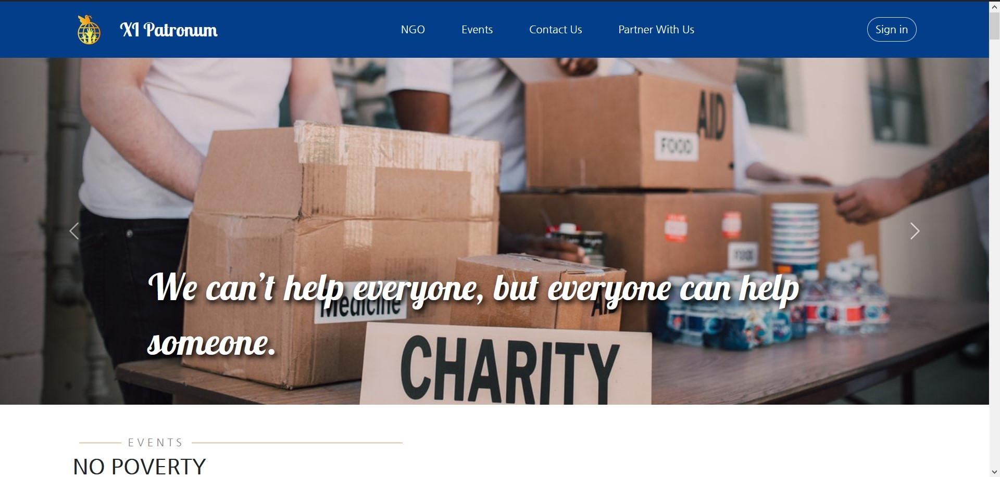
    
## Working
---
Our webiste is divided into 3 different parts as follows:
1. Events Page - This is the main page of our website and consists of all the events that have been posted by the registered organizations. A user can register for the events by clicking the "Register" button. 
Click on the events tab on the navbar and you will be redirected to this page. 
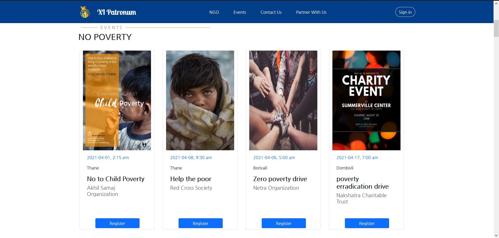

2. Partner with us - The Partner with us page allows organization to register on our platform and connect with a wider userbase. The page also shows all the UN goals that our system aims to satisfy. The registration form includes various details like NGO name, contact information, etc. The form also needs to be provided with the NGO ID assigned to the organization by the government. This will be used to verify the credibilty of the organizations and provide the user with authentic alliances only. They can also check all the UN goals that they work towards which will help the users get a better idea about their work. 
On the navbar, by clicking on NGO displays a mega menu consisting of all the organizations partnered with us. This list is sorted according to the location.
 
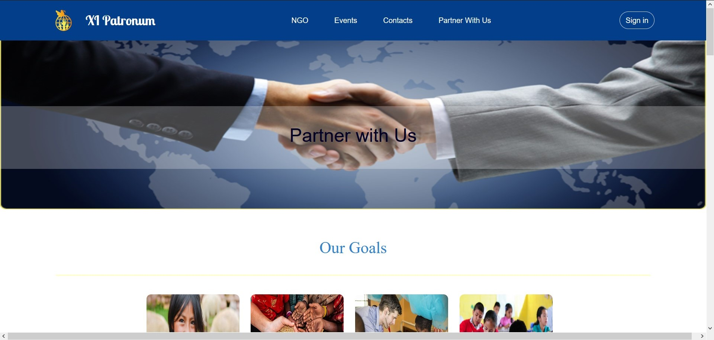
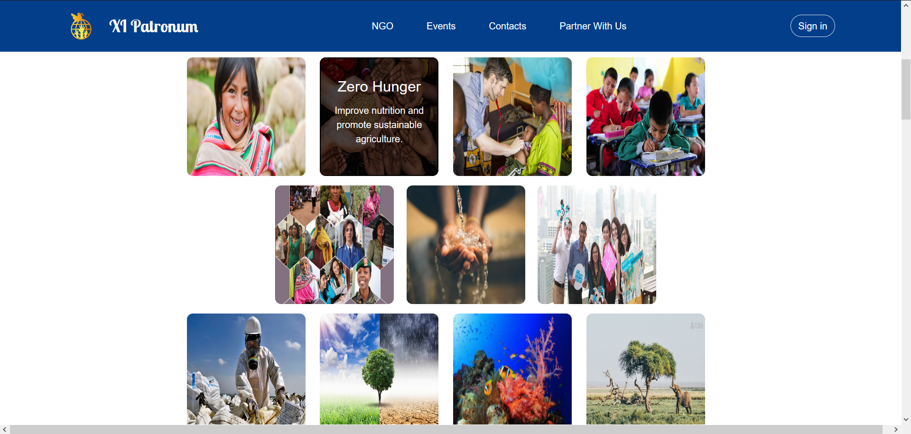
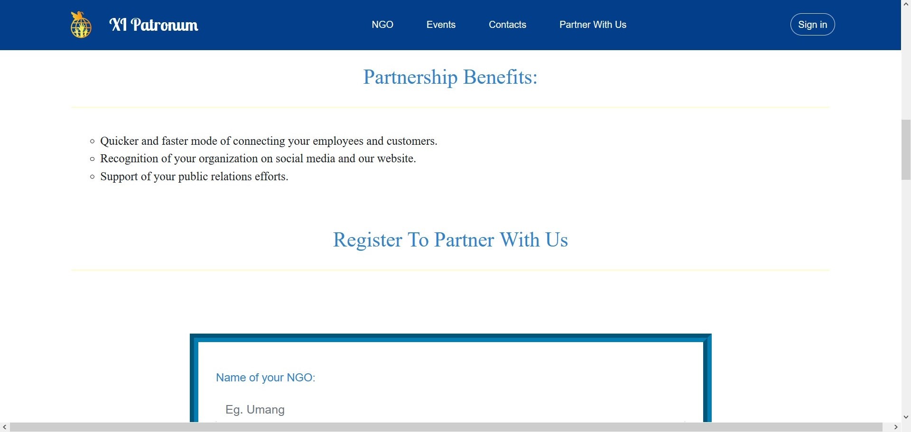
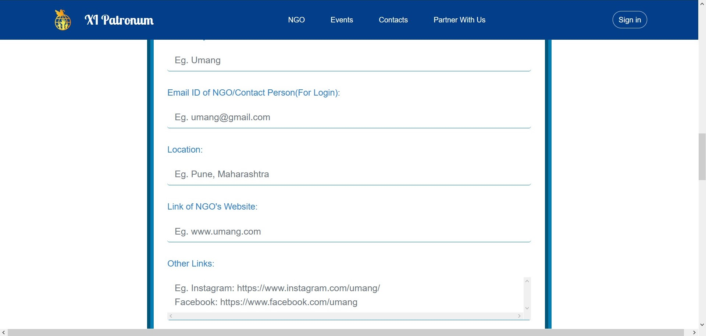

3. Dashboard - There are two types of dashboard: 
    * NGO's Dashboard - After signing in as an NGO, they can either create a new event or edit their profile. 
    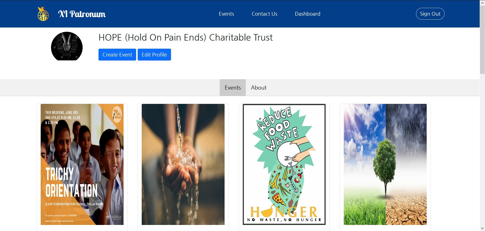 
    Click on create event and fill the details on the form, a new event will be created. 
    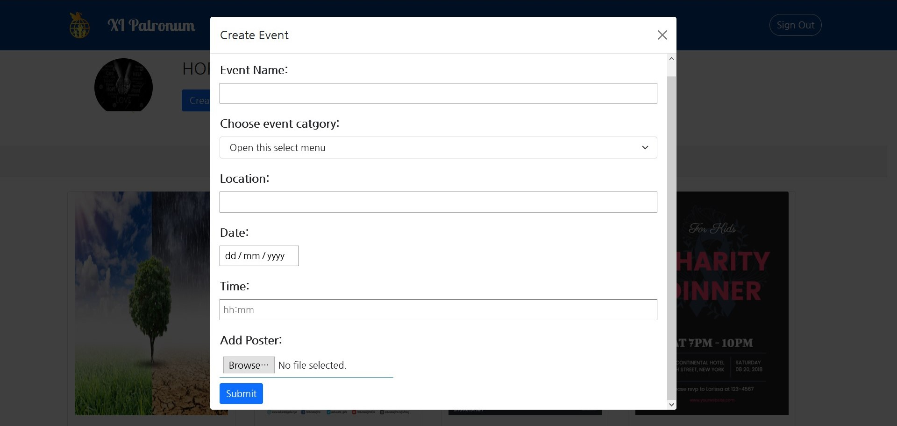 
    For editing profile, click of edit profile. 
    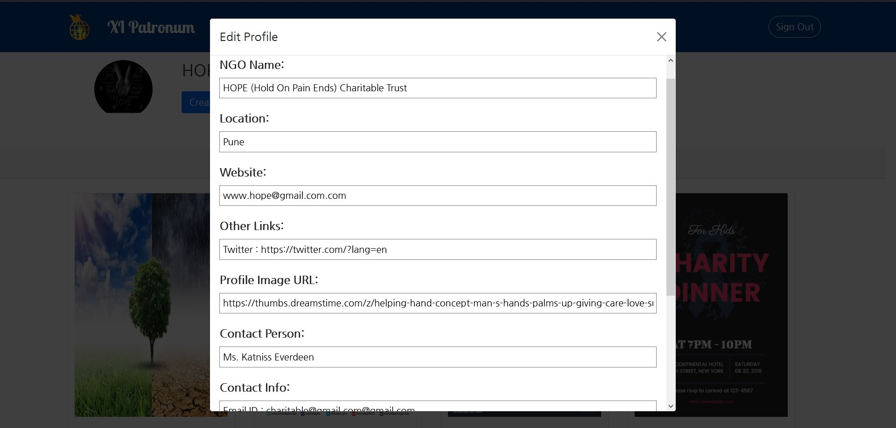 
    In the about page they can see their information displayed on the website. 
    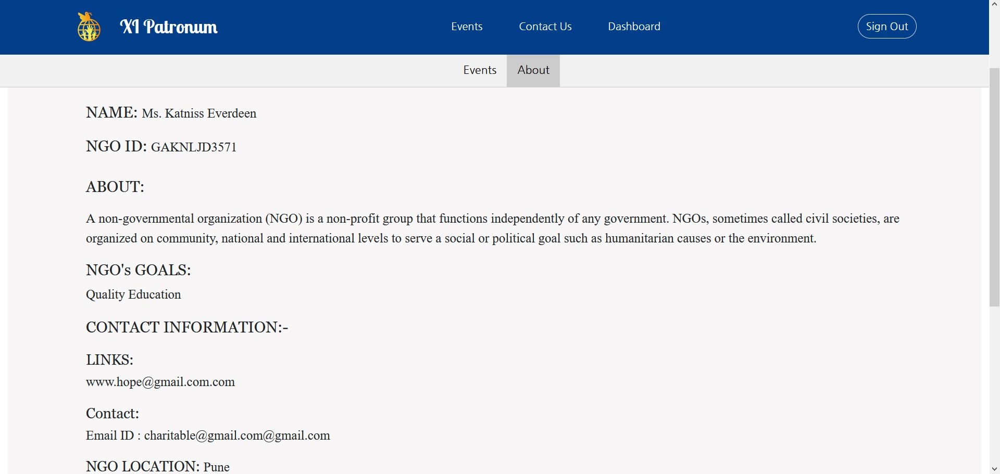  
    
    * User Dashboard - After signing in as a user, you can see your profile on this page. 
    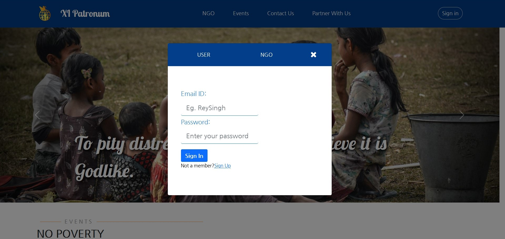 
    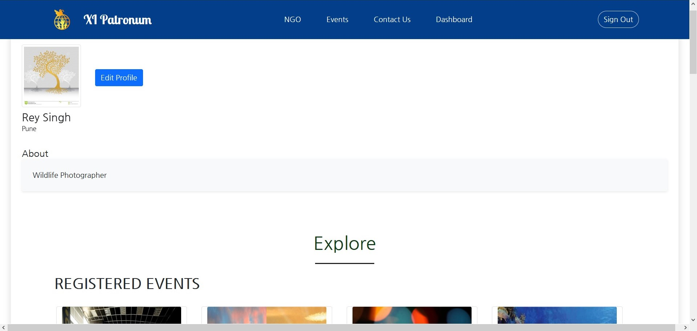 
    You can see all the events to which you have registered. 
    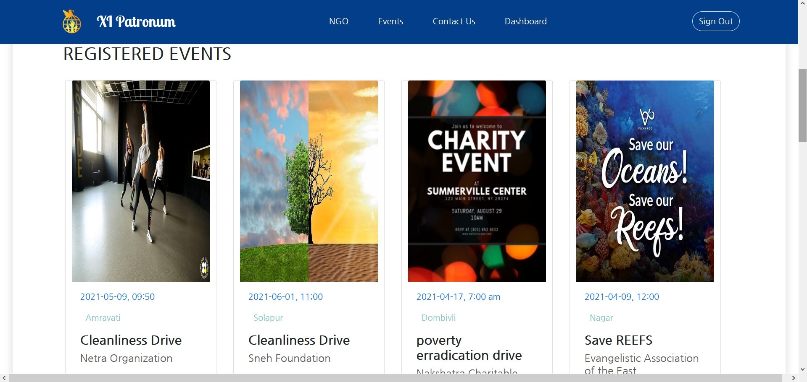 
    If you want to edit the details on your profile, you can go to edit profile and make the required changes. 
    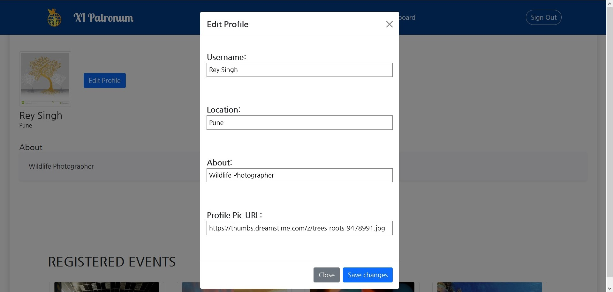 
    We have a contact us form through which users can contact us regarding any queries about various ngos and they can also provide their valuable suggestion through this form. 
    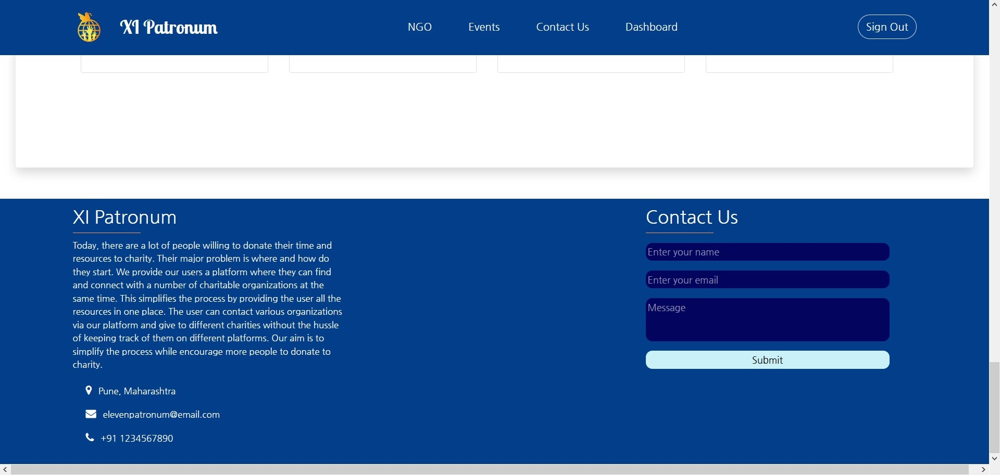 
 
Your queries provided through contact us form will be visible to us. We will try to get your queries solved as soon as possible.
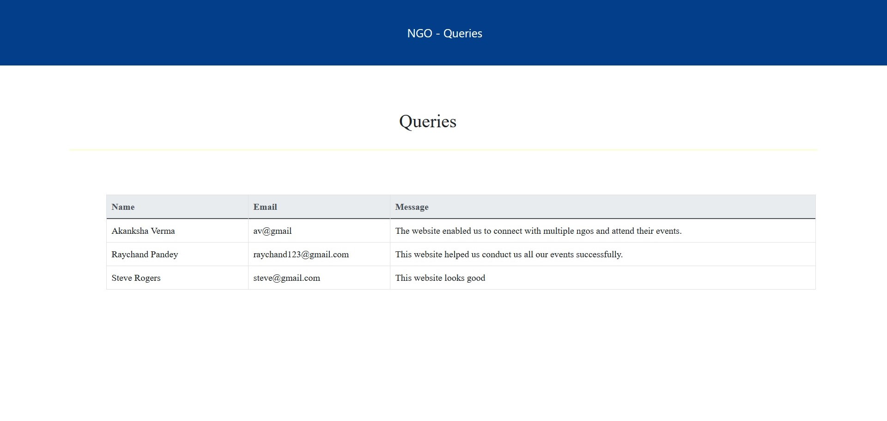 

## Future Scope
---
As of now our solution is adequate for a smaller audience size. Our next step for the project would be to modify it to accomodate a larger audience by adding various functionalities as required. We would also like to automate our verification of the users and organizations to make the project more reliable and fast. We would also like to enhance user experience based on the feedback that we receive from them.

